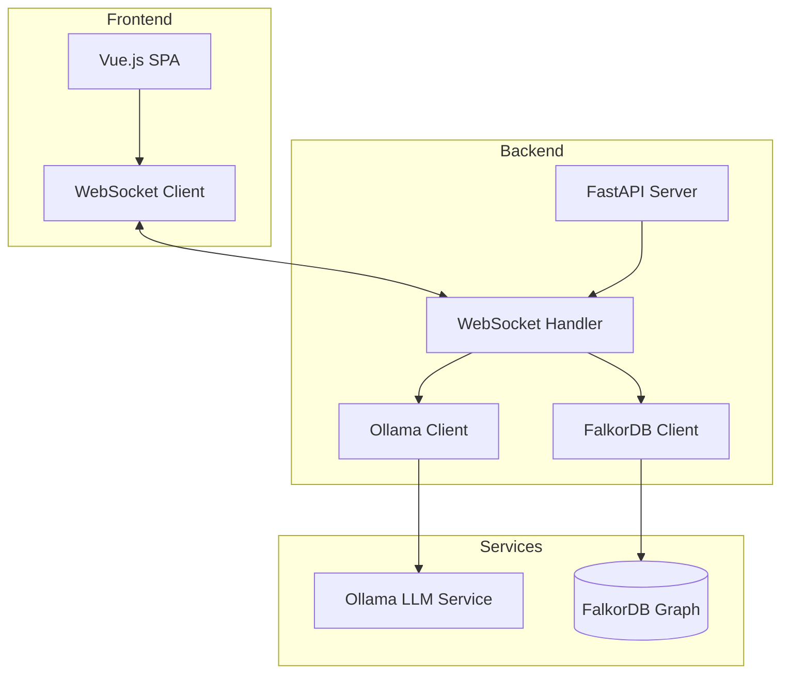
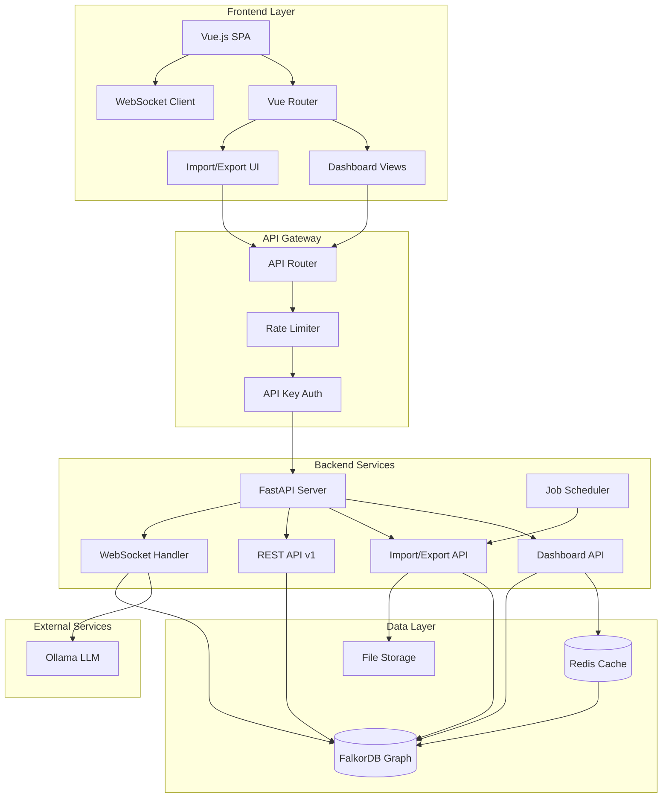
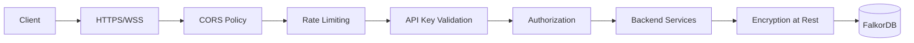
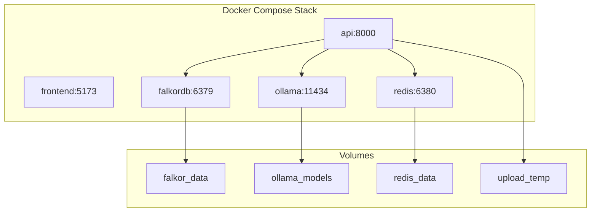

# System Architecture

## Current Architecture

## Enhanced Architecture (With New Features)

## Component Details

### Frontend Layer
- **Vue Router**: Manages navigation between dashboard, main chat, and import/export views
- **Dashboard Views**: Real-time visualization components using Leaflet and Chart.js
- **Import/Export UI**: File upload, validation feedback, and export configuration
- **Pinia Store**: State management for dashboard data and user preferences

### API Gateway Layer
- **Rate Limiter**: Redis-based sliding window rate limiting per API key
- **API Key Auth**: JWT-based API key validation and scope checking
- **API Router**: Routes requests to appropriate backend services

### Backend Services
- **Dashboard API**: Aggregates data for visualization endpoints
- **Import/Export API**: Handles bulk data operations with validation
- **REST API v1**: RESTful wrapper around WebSocket query functionality
- **Job Scheduler**: APScheduler for automated exports and maintenance tasks

### Data Layer
- **Redis**: Caches dashboard queries, stores rate limit counters, API analytics
- **FalkorDB**: Primary graph database for all organizational data
- **File Storage**: Temporary storage for import/export files

## Data Flow Examples

### Dashboard Request Flow
1. User navigates to dashboard
2. Vue component requests `/api/dashboard/overview`
3. Request passes through rate limiter and auth
4. Dashboard API checks Redis cache
5. If cache miss, queries FalkorDB
6. Aggregates and formats data
7. Stores in Redis cache (TTL: 60s)
8. Returns data to frontend

### Import Flow
1. User uploads CSV file
2. File validated client-side
3. POST to `/api/import/employees`
4. Backend validates schema
5. Detects changes vs existing data
6. Creates batch Cypher queries
7. Executes in transaction
8. Returns import summary
9. WebSocket broadcasts updates

### WebSocket Query Flow (Existing)
1. User types natural language query
2. WebSocket message to backend
3. Ollama analyzes intent
4. Generates Cypher query
5. Executes against FalkorDB
6. Formats results with AI
7. Streams response back

## Security Architecture

## Deployment Architecture

## Performance Optimizations

### Caching Strategy
- Dashboard queries: 60s TTL in Redis
- User sessions: 24h TTL
- API responses: 5m TTL for identical queries
- Static assets: Browser cache + CDN

### Database Optimizations
- Graph indices on frequently queried properties
- Materialized views for dashboard aggregations
- Connection pooling (min: 10, max: 50)
- Query timeout: 15s

### Scaling Considerations
- Horizontal scaling: Multiple API instances behind load balancer
- Read replicas: FalkorDB read replicas for dashboard queries
- Queue system: Celery for long-running import jobs
- CDN: Static assets and export files