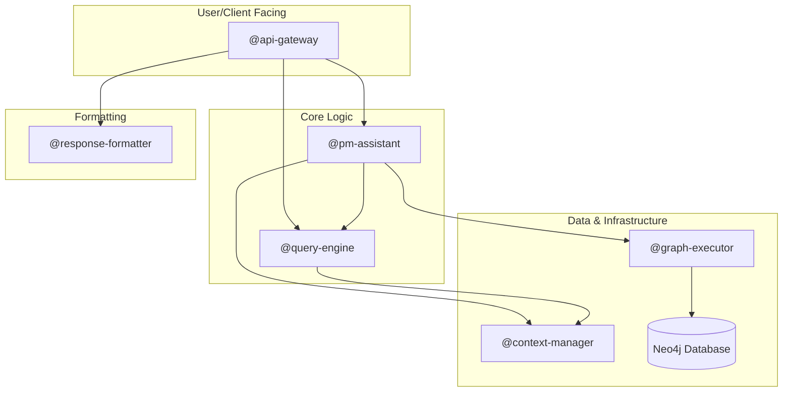

# Module Boundaries and Interface Specification

## Overview

This document defines clear boundaries between the 5 core modules, their interfaces, and communication patterns. The system has been simplified from the original design to reduce complexity while maintaining all functionality through a graph-first approach where ALL data (knowledge and PM) lives in Neo4j.

## Module Design Principles

### 1. Single Responsibility
Each module has one clear purpose and owns its domain completely.

### 2. Explicit Dependencies
All dependencies are declared in module manifests with version constraints.

### 3. Interface Stability
Public interfaces are versioned and backward compatible within major versions.

### 4. Data Encapsulation
Modules own their data and expose it only through defined interfaces.

### 5. Async-First
All module interfaces are asynchronous to support streaming and lazy loading.

## Core Module Definitions (6 Total)

### 1. Query Engine Module (`@query-engine`)

**Purpose**: Convert natural language to Cypher queries for both knowledge and PM operations

**Boundaries**:
- Owns: NL parsing, intent classification, Cypher generation, query optimization
- Does NOT own: Query execution, data storage, result formatting

**Public Interface**:
```typescript
// @query-engine/types.ts
export interface QueryEngineModule extends BaseModule {
  // Convert natural language to Cypher
  generateCypher(query: string, intent?: QueryIntent): Promise<CypherQuery>;
  
  // Classify query intent (knowledge vs PM)
  classifyIntent(query: string): Promise<QueryIntent>;
  
  // Optimize generated queries
  optimizeQuery(cypher: CypherQuery): Promise<CypherQuery>;
  
  // Validate Cypher syntax
  validateCypher(cypher: string): ValidationResult;
}
```

**Module Contract**:
```yaml
module: "@query-engine"
version: "2.0.0"
stability: "stable"
provides:
  - capability: "natural-language-to-cypher"
    interface: "QueryEngineModule"
requires:
  - "@context-manager": "^2.0.0"  # For touchpoint context
events:
  emits: [query.parsed, cypher.generated, intent.classified]
  subscribes: [schema.updated, touchpoint.added]
```

### 2. Graph Executor Module (`@graph-executor`)

**Purpose**: Execute Cypher queries against Neo4j and manage connections

**Boundaries**:
- Owns: Database connections, query execution, transactions, result streaming
- Does NOT own: Query generation, natural language parsing, result formatting

**Public Interface**:
```typescript
// @graph-executor/types.ts
export interface GraphExecutorModule extends BaseModule {
  execute(query: CypherQuery): Promise<QueryResult>;
  executeTransaction(queries: CypherQuery[]): Promise<TransactionResult>;
  stream(query: CypherQuery): AsyncIterator<ResultChunk>;
  explain(query: CypherQuery): Promise<ExecutionPlan>;
}
```

**Module Contract**:
```yaml
module: "@graph-executor"
version: "2.0.0"
provides:
  - capability: "neo4j-execution"
    interface: "GraphExecutorModule"
requires:
  - "neo4j-driver": "^5.0.0"
events:
  emits: [query.executed, connection.created, transaction.completed]
```

### 3. PM Assistant Module (`@pm-assistant`)

**Purpose**: Provides interactive, state-aware assistance for project management.

**Boundaries**:
- Owns: The orchestration logic for "chatting with a project." It reads the current project state from the graph, interacts with a PM via natural language, and uses an LLM to help create new, non-redundant tasks.
- Does NOT own: Autonomous decision-making. It is a tool to augment a human PM, not replace them.

**Public Interface**:
```typescript
// @pm-assistant/types.ts
export interface PMAssistantModule extends BaseModule {
  /**
   * Retrieves the current state of a project to provide context for a conversation.
   */
  getProjectContext(projectId: string): Promise<ProjectContext>;

  /**
   * Given a project context and a user's request to create a new task,
   * this method drafts a new task, checking for redundancy against the current state.
   */
  draftNewTask(context: ProjectContext, taskRequest: string): Promise<TaskDraft>;

  /**
   * Commits a drafted task to the graph database.
   */
  commitTask(draft: TaskDraft): Promise<Task>;
}

export interface ProjectContext {
  projectId: string;
  projectName: string;
  existingTasks: Task[]; // A list of tasks already in the project
  summary: string; // An LLM-generated summary of the current state
}

export interface TaskDraft {
  projectId: string;
  title: string;
  description: string;
  estimatedHours: number;
  dependencies: string[]; // IDs of existing tasks

  // The assistant's analysis of the draft
  analysis: {
    status: 'NEW' | 'DUPLICATE' | 'MODIFICATION'; // The core suggestion
    reason: string; // Explanation for the status
    targetTaskId?: string; // The ID of the task to modify, if status is 'MODIFICATION'
  };
}
```

**Module Contract**:
```yaml
module: "@pm-assistant"
version: "2.0.0"
provides:
  - capability: "interactive-project-assistance"
    interface: "PMAssistantModule"
requires:
  - "@query-engine": "^2.0.0"
  - "@graph-executor": "^2.0.0"
  - "@context-manager": "^2.0.0"
events:
  emits: [task.created, task.drafted]
```

### 4. Response Formatter Module (`@response-formatter`)

**Purpose**: Format query results for different consumers

**Boundaries**:
- Owns: Output formatting, template rendering, localization, pagination
- Does NOT own: Query execution, data transformation logic, caching

**Public Interface**:
```typescript
// @response-formatter/types.ts
export interface ResponseFormatterModule extends BaseModule {
  format(results: QueryResult, options: FormatOptions): Promise<FormattedResponse>;
  getAvailableFormats(): string[];
}
```

**Module Contract**:
```yaml
module: "@response-formatter"
version: "2.0.0"
provides:
  - capability: "result-formatting"
    interface: "ResponseFormatterModule"
requires: []
events:
  emits: [format.completed, format.failed]
```

### 5. Context Manager Module (`@context-manager`)

**Purpose**: Smart context loading with touchpoints and model awareness

**Boundaries**:
- Owns: Context loading, touchpoint management, caching, model-specific sizing
- Does NOT own: Query processing, database access, result formatting

**Public Interface**:
```typescript
// @context-manager/types.ts
export interface ContextManagerModule extends BaseModule {
  loadContext(query: string, model: string): Promise<Context>;
  updateTouchpoints(file: string): Promise<Touchpoint[]>;
  searchTouchpoints(query: string): Promise<Touchpoint[]>;
}
```

**Module Contract**:
```yaml
module: "@context-manager"
version: "2.0.0"
provides:
  - capability: "context-management"
    interface: "ContextManagerModule"
requires: []
events:
  emits: [context.loaded, touchpoint.updated]
  subscribes: [code.modified]
```

### 6. API Gateway Module (`@api-gateway`)

**Purpose**: Provide a stable, human-friendly REST API as a primary entry point for UIs and external services.

**Boundaries**:
- Owns: The REST API surface (e.g., using Fastify or Express), request/response validation, and routing to other modules.
- Does NOT own: Core business logic, which is delegated to other modules.
- **Statelessness**: The API is stateless. Clients (e.g., the CLI) are responsible for maintaining conversational context and sending relevant history with each request.

**Public Interface**:
```typescript
// Example Endpoints
// POST /api/v1/query
// GET /api/v1/projects/{projectId}/context
// POST /api/v1/projects/{projectId}/tasks/draft
```

**Module Contract**:
```yaml
module: "@api-gateway"
version: "2.0.0"
provides:
  - capability: "rest-api"
    interface: "Standard REST/HTTP"
requires:
  - "@query-engine": "^2.0.0"
  - "@pm-assistant": "^2.0.0"
  - "@response-formatter": "^2.0.0"
events:
  emits: [api.request.received]
```

## Simplified Communication Patterns

### 1. Query Pipeline Flow

Main flow for a knowledge graph query:

```typescript
// User Query -> API Gateway -> Query Engine -> Graph Executor -> Response Formatter
class QueryPipeline {
  async processQuery(userQuery: string, model: string): Promise<FormattedResponse> {
    const context = await this.contextManager.loadContext(userQuery, model);
    const intent = await this.queryEngine.classifyIntent(userQuery);
    const cypher = await this.queryEngine.generateCypher(userQuery, intent);
    const results = await this.graphExecutor.execute(cypher);
    return this.formatter.format(results, { format: 'json' });
  }
}
```

Main flow for a PM interaction:
```typescript
// User Request -> API Gateway -> PM Assistant -> (Query Engine & Graph Executor)
class PMPipeline {
  async draftTask(projectId: string, taskRequest: string): Promise<TaskDraft> {
    const context = await this.pmAssistant.getProjectContext(projectId);
    return this.pmAssistant.draftNewTask(context, taskRequest);
  }
}
```

### 2. Event-Based Synchronization

All modules emit events for system-wide coordination:

```typescript
// Event bus for touchpoint and schema synchronization
class SystemEventBus {
  async emit(event: SystemEvent): Promise<void> {
    switch (event.type) {
      case 'code.modified':
        await this.contextManager.updateTouchpoints(event.payload.file);
        break;
      case 'schema.updated':
        await this.queryEngine.refreshSchema();
        break;
    }
  }
}
```

### 3. Graph-First Data Access

All data operations go through the graph, orchestrated by the relevant module.

```typescript
// PM Assistant uses graph queries to read state and write new tasks
class PMAssistant implements PMAssistantModule {
  async getProjectContext(projectId: string): Promise<ProjectContext> {
    const cypher = `MATCH (t:Task)-[:BELONGS_TO]->(:Project {id: $projectId}) RETURN t`;
    const results = await this.graphExecutor.execute({ statement: cypher, parameters: { projectId } });
    // ... process results
  }
}
```

## Simplified Dependency Graph



### Module Dependencies

```yaml
# Minimal dependencies between modules
@api-gateway:
  requires: ["@query-engine", "@pm-assistant", "@response-formatter"]

@query-engine:
  requires: ["@context-manager"]
  
@graph-executor:
  requires: ["neo4j-driver"]
  
@pm-assistant:
  requires: ["@query-engine", "@graph-executor", "@context-manager"]
  
@response-formatter:
  requires: []

@context-manager:
  requires: []
```

### 2. Dependency Injection

```typescript
// Module container handles dependency injection
class ModuleContainer {
  private modules = new Map<string, Module>();
  
  async loadModule(moduleId: string): Promise<Module> {
    const manifest = await this.loadManifest(moduleId);
    const dependencies = await this.loadDependencies(manifest);
    const ModuleClass = await this.importModule(moduleId);
    return new ModuleClass(dependencies);
  }
}
```

### 3. Version Compatibility

```typescript
interface VersionPolicy {
  // Semantic versioning rules
  major: 'breaking-changes';
  minor: 'backward-compatible-features';
  patch: 'backward-compatible-fixes';
  
  // Deprecation policy
  deprecation: {
    warningPeriod: '6-months';
    removalPolicy: 'next-major-version';
  };
}
```

## Error Handling Across Boundaries

### 1. Error Types

```typescript
// Base error class for all modules
export class ModuleError extends Error {
  constructor(
    public module: string,
    public code: string,
    message: string,
    public cause?: Error
  ) {
    super(message);
  }
}

// Specific error types
export class ValidationError extends ModuleError {}
export class TimeoutError extends ModuleError {}
export class DependencyError extends ModuleError {}
```

### 2. Error Propagation

```typescript
// Modules wrap and propagate errors with context
class GraphEngine {
  async generateQuery(intent: QueryIntent): Promise<CypherQuery> {
    try {
      return await this.generate(intent);
    } catch (error) {
      throw new ModuleError(
        '@graph-engine',
        'QUERY_GENERATION_FAILED',
        `Failed to generate query for intent type: ${intent.type}`,
        error
      );
    }
  }
}
```

### 3. Error Recovery

```typescript
interface ErrorRecoveryStrategy {
  retry?: {
    attempts: number;
    backoff: 'linear' | 'exponential';
    maxDelay: number;
  };
  
  fallback?: {
    handler: (error: Error) => Promise<any>;
  };
  
  circuitBreaker?: {
    threshold: number;
    timeout: number;
  };
}
```

## Testing Module Boundaries

### 1. Contract Testing

```typescript
describe('Module Contract: @graph-engine', () => {
  let graphEngine: GraphEngineModule;
  
  beforeEach(() => {
    graphEngine = new GraphEngine();
  });
  
  describe('generateQuery', () => {
    it('returns valid CypherQuery for valid intent', async () => {
      const intent: QueryIntent = {
        type: 'FIND_ENTITY',
        entities: [{ type: 'Person', filters: [] }],
        filters: [],
        relationships: [],
        aggregations: []
      };
      
      const query = await graphEngine.generateQuery(intent);
      
      expect(query).toMatchObject({
        statement: expect.any(String),
        parameters: expect.any(Object),
        timeout: expect.any(Number)
      });
    });
    
    it('throws ValidationError for invalid intent', async () => {
      const invalidIntent = {} as QueryIntent;
      
      await expect(graphEngine.generateQuery(invalidIntent))
        .rejects.toThrow(ValidationError);
    });
  });
});
```

### 2. Integration Testing

```typescript
describe('Module Integration: Query Pipeline', () => {
  let container: ModuleContainer;
  let queryInterface: QueryInterfaceModule;
  
  beforeEach(async () => {
    container = new ModuleContainer();
    await container.loadModules([
      '@query-interface',
      '@graph-engine',
      '@query-executor',
      '@response-formatter'
    ]);
    
    queryInterface = container.get('@query-interface');
  });
  
  it('processes query through full pipeline', async () => {
    const request: QueryRequest = {
      id: 'test-1',
      query: 'Find all engineers in London',
      options: { format: 'json' }
    };
    
    const response = await queryInterface.processQuery(request);
    
    expect(response.status).toBe('success');
    expect(response.results).toBeDefined();
    expect(response.metadata.modules).toContain('@graph-engine');
  });
});
```

### 3. Mock Boundaries

```typescript
// Mock module for testing
class MockGraphEngine implements GraphEngineModule {
  async generateQuery(intent: QueryIntent): Promise<CypherQuery> {
    return {
      statement: 'MATCH (n) RETURN n',
      parameters: {},
      timeout: 1000,
      options: {}
    };
  }
}

// Use in tests
const queryInterface = new QueryInterface(
  new MockGraphEngine(),
  new MockResponseFormatter()
);
```

## Module Lifecycle Management

### 1. Initialization

```typescript
interface ModuleLifecycle {
  // Called when module is loaded
  async initialize(config: ModuleConfig): Promise<void>;
  
  // Called when dependencies are ready
  async start(): Promise<void>;
  
  // Health check
  async healthCheck(): Promise<HealthStatus>;
  
  // Graceful shutdown
  async shutdown(): Promise<void>;
}
```

### 2. Hot Reloading

```typescript
class ModuleReloader {
  async reloadModule(moduleId: string): Promise<void> {
    // Save current state
    const state = await this.saveModuleState(moduleId);
    
    // Unload old version
    await this.unloadModule(moduleId);
    
    // Load new version
    const newModule = await this.loadModule(moduleId);
    
    // Restore state
    await this.restoreModuleState(newModule, state);
    
    // Update dependencies
    await this.updateDependentModules(moduleId);
  }
}
```

## Performance Boundaries

### 1. Resource Allocation

```typescript
interface ModuleResources {
  memory: {
    min: number;
    max: number;
    alert: number;
  };
  
  cpu: {
    cores: number;
    priority: 'high' | 'normal' | 'low';
  };
  
  io: {
    maxConcurrentOps: number;
    queueSize: number;
  };
}
```

### 2. Performance Monitoring

```typescript
interface ModuleMetrics {
  // Operation metrics
  operations: {
    count: number;
    successRate: number;
    errorRate: number;
    avgDuration: number;
    p95Duration: number;
  };
  
  // Resource metrics  
  resources: {
    memoryUsed: number;
    cpuPercent: number;
    activeConnections: number;
  };
  
  // Business metrics
  business: {
    [key: string]: number;
  };
}
```

## Security Boundaries

### 1. Access Control

```typescript
interface ModulePermissions {
  // Who can call this module
  callers: string[] | '*';
  
  // What operations are allowed
  operations: {
    [operation: string]: {
      roles: string[];
      rateLimit?: number;
    };
  };
  
  // Data access restrictions
  dataAccess: {
    read: string[];
    write: string[];
  };
}
```

### 2. Data Sanitization

```typescript
// Modules sanitize data at boundaries
class QueryInterface {
  async processQuery(request: QueryRequest): Promise<QueryResponse> {
    // Sanitize input
    const sanitized = this.sanitizeInput(request);
    
    // Validate against schema
    this.validateRequest(sanitized);
    
    // Process with sanitized data
    return this.process(sanitized);
  }
  
  private sanitizeInput(request: QueryRequest): QueryRequest {
    return {
      ...request,
      query: this.sanitizeString(request.query),
      user: request.user ? this.sanitizeUser(request.user) : undefined
    };
  }
}
```