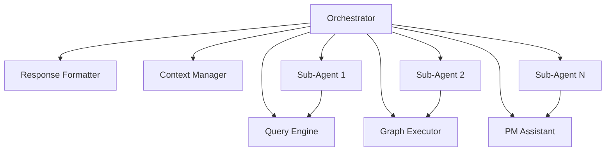

# Sub-Agent Orchestration Specification (Development Tool)

## Overview

**IMPORTANT: This is a development-time tool for building the system, NOT a feature of the system itself.**

The Sub-Agent Orchestration System enables Claude Code to manage context window limitations during development by programmatically delegating well-defined tasks to headless sub-agents. This architecture maintains the main conversation's focus on architectural decisions while offloading specific implementation work to parallel sub-processes with strict validation criteria.

This tool is used exclusively during development to help build the Enterprise Knowledge Graph & PM Assistant System more efficiently.

## Development Tool Architecture

### 1. How It Helps Development

The orchestration system helps developers build the system's 5 core modules more efficiently:



### 2. Development Task Tracking (Optional)

During development, you can optionally use Neo4j to track orchestration tasks:

```cypher
// Task delegation nodes
(:SubAgentTask {
  id: String!
  type: String  // 'documentation' | 'test_gen' | 'refactor'
  status: String  // 'pending' | 'running' | 'completed' | 'failed'
  created_at: DateTime
  started_at: DateTime?
  completed_at: DateTime?
  attempts: Integer
  max_attempts: Integer
  timeout_seconds: Integer
})

// Task relationships
(:Claude)-[:DELEGATED]->(task:SubAgentTask)
(task)-[:EXECUTED_BY]->(agent:SubAgent)
(task)-[:VALIDATES_WITH]->(criterion:SuccessCriterion)
(task)-[:MODIFIES]->(file:File)
(task)-[:PRODUCES]->(result:TaskResult)
```

## Core Components

### 1. Task Identification Engine

Identifies tasks suitable for delegation based on:
- Context window usage (>70% threshold)
- Task isolation (minimal dependencies)
- Clear success criteria definability
- No user interaction requirements

```typescript
interface TaskIdentifier {
  analyzeForDelegation(request: string): DelegationCandidate[];
  
  isDelegatable(task: TaskDescription): boolean {
    return task.hasCleanBoundaries() &&
           task.hasTestableOutcomes() &&
           task.requiresNoUserInput() &&
           !task.modifiesCriticalState();
  }
}
```

### 2. Prompt Template System

Strict, no-compromise prompt templates ensure sub-agents stay within boundaries:

```typescript
interface PromptTemplate {
  id: string;
  taskType: TaskType;
  template: string;
  requiredParams: string[];
  forbiddenActions: string[];
  successCriteria: CriterionDefinition[];
}

// Templates stored in Neo4j
(:PromptTemplate {
  id: 'doc_update_strict',
  task_type: 'documentation',
  template: '...',
  forbidden_patterns: ['*.py', '*.js'],  // No code modifications
  required_outputs: ['updated_date', 'examples']
})
```

### 3. Success Criteria Framework

Comprehensive validation system with programmatically verifiable criteria:

```typescript
enum CriterionType {
  FILE_EXISTS = "file_exists",
  FILE_CONTAINS = "file_contains", 
  COMMAND_SUCCEEDS = "command_succeeds",
  AST_VALID = "ast_valid",
  COVERAGE_MET = "coverage_met",
  NO_CHANGES_TO = "no_changes_to"
}

interface SuccessCriterion {
  name: string;
  type: CriterionType;
  config: Record<string, any>;
  required: boolean;
  
  validate(context: ValidationContext): ValidationResult;
}
```

### 4. Execution Engine

Manages sub-agent lifecycle using Claude Code's CLI capabilities:

```typescript
class SubAgentExecutor {
  async execute(task: SubAgentTask): Promise<TaskResult> {
    const command = [
      'claude',
      '--print',  // Non-interactive mode
      '--output-format', 'json',  // Structured output
      '--dangerously-skip-permissions',  // Full automation
      '--max-turns', task.maxAttempts,
      '--allowedTools', task.getAllowedTools(),
      '--file', task.promptFile
    ];
    
    const result = await this.runWithTimeout(command, task.timeout);
    return this.validateResult(result, task.successCriteria);
  }
}
```

## Task Types and Patterns

### 1. Documentation Updates

```typescript
const docTask = {
  type: TaskType.DOCUMENTATION,
  scope: ['README.md', 'docs/'],
  forbiddenPatterns: ['*.py', '*.js', '*.ts'],
  requiredElements: ['updated_date', 'code_examples'],
  validation: [
    { type: 'file_contains', text: 'Last updated:' },
    { type: 'no_changes_to', patterns: ['src/', 'tests/'] }
  ]
};
```

### 2. Test Generation

```typescript
const testTask = {
  type: TaskType.TEST_GENERATION,
  targetModule: 'src/utils.py',
  outputFile: 'tests/test_utils.py',
  coverageTarget: 95,
  validation: [
    { type: 'file_exists', path: 'tests/test_utils.py' },
    { type: 'command_succeeds', cmd: 'pytest tests/test_utils.py' },
    { type: 'coverage_met', target: 95 }
  ]
};
```

### 3. Code Refactoring

```typescript
const refactorTask = {
  type: TaskType.REFACTOR,
  operation: 'rename_variable',
  scope: ['src/models/', 'src/views/'],
  preserveBehavior: true,
  validation: [
    { type: 'command_succeeds', cmd: 'npm test' },
    { type: 'ast_valid', files: ['src/**/*.py'] },
    { type: 'no_breaking_changes' }
  ]
};
```

## Integration with Context Manager

The orchestration system works with the Context Manager to prevent bloat:

```typescript
class ContextAwareOrchestrator {
  constructor(
    private contextManager: ContextManagerModule,
    private orchestrator: SubAgentOrchestrator
  ) {}
  
  async processWithContextManagement(request: string, model: string) {
    const contextSize = await this.contextManager.getCurrentSize();
    const maxSize = this.contextManager.getMaxContextSize(model);
    
    if (contextSize > maxSize * 0.7) {
      // Identify delegatable tasks
      const tasks = await this.identifyDelegatableTasks(request);
      
      // Offload to sub-agents
      const results = await this.orchestrator.delegateTasks(tasks);
      
      // Return summaries instead of full results
      return this.summarizeResults(results);
    }
    
    // Normal processing if context is manageable
    return this.processNormally(request);
  }
}
```

## Event Integration

The orchestration system emits events for system-wide coordination:

```typescript
// Orchestration events
eventBus.on('context.limit.approaching', async (event) => {
  const delegatableTasks = await orchestrator.scanForDelegation();
  if (delegatableTasks.length > 0) {
    await orchestrator.beginDelegation(delegatableTasks);
  }
});

eventBus.on('subagent.task.completed', async (event) => {
  // Update graph with results
  await graphExecutor.execute(`
    MATCH (t:SubAgentTask {id: $taskId})
    SET t.status = 'completed',
        t.completed_at = datetime()
    CREATE (t)-[:PRODUCED]->(r:TaskResult {
      success: $success,
      summary: $summary,
      files_modified: $files
    })
  `, event.payload);
});
```

## Failure Handling

### Binary Success Model

Tasks either succeed completely or fail explicitly:

```typescript
interface TaskResult {
  task_id: string;
  success: boolean;  // No partial success
  
  // On success
  output?: {
    summary: string;
    files_modified: string[];
    metrics: Record<string, any>;
  };
  
  // On failure
  error?: {
    reason: string;
    failed_criteria: string[];
    attempt_count: number;
  };
}
```

### Retry Strategy

```typescript
class RetryableExecutor {
  async executeWithRetry(task: SubAgentTask): Promise<TaskResult> {
    for (let attempt = 1; attempt <= task.maxAttempts; attempt++) {
      const result = await this.execute(task);
      
      if (result.success) {
        return result;
      }
      
      // Exponential backoff
      await this.delay(Math.pow(2, attempt) * 1000);
      
      // Adjust prompt based on failure
      task.prompt = this.adjustPromptForRetry(task.prompt, result.error);
    }
    
    return { success: false, error: 'Max attempts exceeded' };
  }
}
```

## Performance Benefits

### 1. Context Window Optimization

```
Without Orchestration:
- Main context: 100K tokens (approaching limit)
- Processing slows down
- Risk of context overflow

With Orchestration:
- Main context: 60K tokens (manageable)
- Sub-agent 1: 20K tokens (documentation task)
- Sub-agent 2: 15K tokens (test generation)
- Sub-agent 3: 10K tokens (refactoring)
```

### 2. Parallel Execution

```typescript
// Sequential (traditional)
const tasks = [updateDocs, generateTests, refactorCode];
for (const task of tasks) {
  await execute(task);  // Total time: sum of all tasks
}

// Parallel (orchestrated)
const results = await Promise.all(
  tasks.map(task => subAgent.execute(task))
);  // Total time: max of all tasks
```

## Security Considerations

### 1. Tool Restrictions

Each sub-agent has minimal tool access:

```typescript
const toolRestrictions = {
  documentation: ['Read', 'Write', 'Edit'],  // No Bash
  test_generation: ['Read', 'Write', 'Bash'],  // No system access
  analysis: ['Read', 'Grep', 'Glob'],  // Read-only
};
```

### 2. Scope Enforcement

```cypher
// Track all file modifications
CREATE (agent:SubAgent {id: $agentId})-[:MODIFIED]->(file:File {path: $path})

// Validate against allowed patterns
MATCH (task:SubAgentTask {id: $taskId})-[:ALLOWS_PATTERN]->(pattern:Pattern)
WHERE file.path =~ pattern.regex
RETURN COUNT(*) > 0 as allowed
```

## Usage Examples

### 1. Automatic Documentation Update

```typescript
// Main Claude session detects code changes
const changedFiles = ['src/api/users.py', 'src/models/user.py'];

// Create documentation task
const docTask = orchestrator.createTask({
  type: TaskType.DOCUMENTATION,
  description: "Update API docs for user endpoint changes",
  context_files: changedFiles,
  target_files: ['README.md', 'docs/API.md'],
  success_criteria: [
    { type: 'file_contains', path: 'README.md', text: 'Last updated:' },
    { type: 'file_contains', path: 'docs/API.md', text: 'User Endpoints' },
    { type: 'no_changes_to', patterns: ['*.py'] }
  ]
});

// Delegate to sub-agent
const result = await orchestrator.delegate(docTask);
console.log(`Documentation updated: ${result.success}`);
```

### 2. Parallel Test Generation

```typescript
// Generate tests for multiple modules simultaneously
const modules = ['utils', 'validators', 'formatters'];

const testTasks = modules.map(module => ({
  type: TaskType.TEST_GENERATION,
  module: `src/${module}.py`,
  coverage_target: 90,
  timeout: 300
}));

// Execute in parallel
const results = await orchestrator.delegateMany(testTasks, { parallel: 3 });
```

## Best Practices

### 1. Task Granularity

- Keep tasks focused and atomic
- One clear objective per task
- Minimal context requirements
- Clear success/failure conditions

### 2. Prompt Engineering

- Use strict, explicit language
- Define all boundaries clearly
- Include failure conditions
- No room for interpretation

### 3. Validation Design

- All criteria must be programmatically verifiable
- Prefer binary outcomes over gradual success
- Include both positive and negative checks
- Validate both output and side effects

## Future Enhancements

### 1. Learning System

```cypher
// Track successful patterns
CREATE (pattern:SuccessfulPattern {
  task_type: $type,
  prompt_template: $template,
  success_rate: $rate,
  avg_duration: $duration
})
```

### 2. Cost Optimization

```typescript
interface CostAwareOrchestrator {
  estimateCost(task: SubAgentTask): number;
  optimizeForCost(tasks: SubAgentTask[]): SubAgentTask[];
  trackSpending(period: DateRange): CostReport;
}
```

### 3. Visual Monitoring

```typescript
interface OrchestrationDashboard {
  activeAgents: SubAgentStatus[];
  taskQueue: QueuedTask[];
  completionRate: number;
  contextUsage: ContextMetrics;
  costTracking: CostMetrics;
}
```

## Summary

The Sub-Agent Orchestration System provides a powerful solution for managing context limitations while maintaining code quality and task isolation. By leveraging Claude Code's CLI capabilities and strict validation frameworks, the system enables parallel, reliable task execution without compromising on quality or safety.

Integration with the Neo4j graph database ensures all orchestration activities are tracked, queryable, and part of the unified system architecture.
