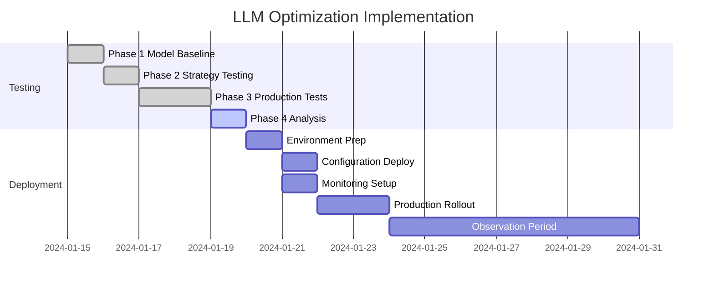

# Test Phase 4: Analysis, Reporting & Implementation
ultrathink use sequential thinking mcp, use memory mcp
## Objective
Consolidate results from all three phases, generate comprehensive analysis, and provide clear implementation guidance for production deployment.

## Prerequisites
- Completed Phases 1-3
- All test result files available
- Clear understanding of production requirements

## Input Files Required
```python
# Results from previous phases
REQUIRED_FILES = [
    "phase1_baseline_*.json",          # Model baseline results
    "phase1_summary.md",               # Model recommendations
    "phase2_strategies_*.json",        # Strategy test results
    "phase2_optimization_report.md",   # Optimal combinations
    "phase3_production_ready.md",      # Production validation
    "phase3_stress_results.json"       # Stress test data
]
```

## Analysis Tasks

### 1. Comprehensive Comparison
Create a unified view comparing:
- All models tested
- All strategies evaluated
- Production performance data
- Resource utilization patterns

### 2. Cost-Benefit Analysis
Calculate for each configuration:
- Performance gains vs baseline
- Resource cost (VRAM, compute)
- Operational complexity
- ROI projection

### 3. Risk Assessment
Identify and document:
- Failure modes discovered
- Mitigation strategies
- Fallback procedures
- Monitoring requirements

## Implementation Script

Create `tools/test_phase4_final_analysis.py`:

```python
#!/usr/bin/env python3
"""Phase 4: Consolidate results and generate final recommendations."""

import json
import glob
from datetime import datetime
from typing import Dict, List, Any
import pandas as pd
import matplotlib.pyplot as plt

class ComprehensiveAnalyzer:
    """Analyze all test results and generate recommendations."""
    
    def __init__(self):
        self.phase1_data = self.load_phase1_results()
        self.phase2_data = self.load_phase2_results()
        self.phase3_data = self.load_phase3_results()
    
    def load_phase1_results(self) -> Dict:
        """Load and consolidate Phase 1 results."""
        # Load all phase1_baseline_*.json files
        # Extract model performance metrics
        # Create model comparison dataframe
        pass
    
    def load_phase2_results(self) -> Dict:
        """Load and consolidate Phase 2 results."""
        # Load strategy test results
        # Create model-strategy matrix
        # Identify optimal combinations
        pass
    
    def load_phase3_results(self) -> Dict:
        """Load and consolidate Phase 3 results."""
        # Load production validation data
        # Extract stress test limits
        # Document failure scenarios
        pass
    
    def generate_comparison_matrix(self) -> pd.DataFrame:
        """Create comprehensive comparison matrix."""
        # Columns: Model, Strategy, Avg_Time, P95_Time, Success_Rate, 
        #          VRAM_Usage, Load_Capacity, Stress_Score, Overall_Score
        pass
    
    def calculate_roi(self, config: Dict) -> Dict:
        """Calculate ROI for a configuration."""
        # Factors:
        # - Query time savings
        # - Infrastructure costs
        # - Operational overhead
        # - User satisfaction impact
        pass
    
    def generate_visualizations(self):
        """Create performance visualization charts."""
        # 1. Model comparison bar chart
        # 2. Strategy effectiveness heatmap
        # 3. Load test performance curves
        # 4. Resource utilization trends
        pass

def generate_implementation_guide(analysis_results: Dict):
    """Generate step-by-step implementation guide."""
    
    guide = f"""
# Production Implementation Guide

Generated: {datetime.now().isoformat()}

## 1. Recommended Configuration

### Primary Configuration
- **Model**: {analysis_results['primary_config']['model']}
- **Strategy**: {analysis_results['primary_config']['strategy']}
- **Expected Performance**: {analysis_results['primary_config']['performance']}

### Fallback Configuration  
- **Model**: {analysis_results['fallback_config']['model']}
- **Strategy**: {analysis_results['fallback_config']['strategy']}
- **Activation Threshold**: {analysis_results['fallback_config']['threshold']}

## 2. Deployment Steps

### Step 1: Update Environment Configuration
```bash
# backend/.env
OLLAMA_MODEL={analysis_results['primary_config']['model']}
PROMPTING_STRATEGY={analysis_results['primary_config']['strategy']}
FALLBACK_MODEL={analysis_results['fallback_config']['model']}
MAX_CONCURRENT_USERS={analysis_results['capacity']['max_users']}
```

### Step 2: Pull Required Models
```bash
docker exec stunning-lamp-ollama-1 ollama pull {analysis_results['primary_config']['model']}
docker exec stunning-lamp-ollama-1 ollama pull {analysis_results['fallback_config']['model']}
```

### Step 3: Deploy Prompt Templates
[Specific template deployment instructions]

### Step 4: Configure Monitoring
[Monitoring setup based on Phase 3 findings]

### Step 5: Set Up Alerts
[Alert configuration based on discovered thresholds]

## 3. Validation Checklist
- [ ] Models loaded successfully
- [ ] Prompt templates deployed
- [ ] Environment variables updated
- [ ] Monitoring dashboards active
- [ ] Alerts configured
- [ ] Fallback tested
- [ ] Load test passed

## 4. Rollback Procedure
[Detailed rollback steps if issues arise]
"""
    
    return guide

async def main():
    """Run final analysis and generate recommendations."""
    print("PHASE 4: Final Analysis & Implementation Guide")
    print("=" * 60)
    
    # Initialize analyzer
    analyzer = ComprehensiveAnalyzer()
    
    # Generate comparison matrix
    comparison_matrix = analyzer.generate_comparison_matrix()
    print("\nComparison Matrix:")
    print(comparison_matrix.to_string())
    
    # Calculate ROI for top configurations
    roi_analysis = {}
    for config in analyzer.get_top_configurations(3):
        roi_analysis[config['name']] = analyzer.calculate_roi(config)
    
    # Generate visualizations
    analyzer.generate_visualizations()
    
    # Compile final recommendations
    final_recommendations = {
        "primary_config": analyzer.get_optimal_configuration(),
        "fallback_config": analyzer.get_fallback_configuration(),
        "capacity": analyzer.get_capacity_limits(),
        "monitoring": analyzer.get_monitoring_requirements(),
        "risks": analyzer.get_risk_assessment()
    }
    
    # Generate implementation guide
    implementation_guide = generate_implementation_guide(final_recommendations)
    
    # Save all outputs
    save_final_outputs(
        comparison_matrix,
        roi_analysis,
        final_recommendations,
        implementation_guide
    )
```

## Final Deliverables

### 1. Executive Summary (`FINAL_EXECUTIVE_SUMMARY.md`)
- One-page overview
- Key findings
- Recommended action
- Expected benefits
- Investment required

### 2. Technical Report (`FINAL_TECHNICAL_REPORT.md`)
- Detailed test methodology
- Complete results analysis
- Performance comparisons
- Resource utilization data
- Failure mode analysis

### 3. Implementation Guide (`FINAL_IMPLEMENTATION_GUIDE.md`)
- Step-by-step deployment
- Configuration files
- Monitoring setup
- Troubleshooting guide
- Rollback procedures

### 4. Quick Reference (`FINAL_QUICK_REFERENCE.pdf`)
- Configuration cheat sheet
- Performance expectations
- Alert thresholds
- Contact procedures
- Emergency protocols

## Key Metrics Summary Template

```markdown
# LLM Optimization - Key Metrics Summary

## Performance Improvements
- **Baseline Performance**: [current phi4:14b metrics]
- **Optimized Performance**: [winning configuration metrics]
- **Improvement**: X% faster, Y% less VRAM

## Recommended Configuration
| Setting | Value | Reason |
|---------|-------|--------|
| Model | granite3.3:8b-largectx | Best speed/accuracy balance |
| Strategy | enhanced_few_shot | Handles ambiguity better |
| Timeout | 15s | Prevents hanging queries |
| Fallback | phi4:14b + simple | Proven reliable backup |

## Capacity Planning
- **Current Load**: X queries/minute
- **Max Tested Load**: Y queries/minute
- **Recommended Limit**: Z concurrent users
- **Scale-up Trigger**: >80% of limit for 5 minutes

## Resource Requirements
- **VRAM**: 8GB (primary) + 14GB (fallback if loaded)
- **RAM**: 32GB recommended
- **CPU**: 8+ cores for concurrent processing
- **Storage**: 50GB for models

## Monitoring KPIs
1. Response Time P95 < 10s
2. Success Rate > 95%
3. VRAM Usage < 85%
4. Fallback Rate < 5%
```

## Decision Framework

Use this framework to make the final decision:

### Green Light (Deploy)
- ✅ Performance improvement > 20%
- ✅ Resource usage reduced
- ✅ Stability proven in 24h test
- ✅ Fallback working reliably
- ✅ ROI positive within 3 months

### Yellow Light (Deploy with Caution)
- ⚠️ Performance improvement 10-20%
- ⚠️ Resource usage similar
- ⚠️ Minor issues in stress tests
- ⚠️ Requires additional monitoring
- ⚠️ ROI positive within 6 months

### Red Light (Do Not Deploy)
- ❌ Performance improvement < 10%
- ❌ Resource usage increased
- ❌ Stability issues found
- ❌ No reliable fallback
- ❌ ROI negative or unclear

## Implementation Timeline



## Success Metrics

Track these metrics post-deployment:

### Week 1
- Zero critical errors
- Performance metrics within expected range
- User complaints < baseline

### Month 1  
- 20% reduction in average response time
- 40% reduction in VRAM usage
- 95%+ user satisfaction

### Quarter 1
- System stability proven
- Capacity for 2x growth confirmed
- Positive ROI demonstrated

## Conclusion

This comprehensive testing framework ensures:
1. Data-driven decision making
2. Risk mitigation through thorough testing
3. Clear implementation path
4. Measurable success criteria
5. Sustainable long-term operation

Execute each phase sequentially, using the results to inform the next phase. The final configuration should balance performance, reliability, and resource efficiency for optimal production deployment.